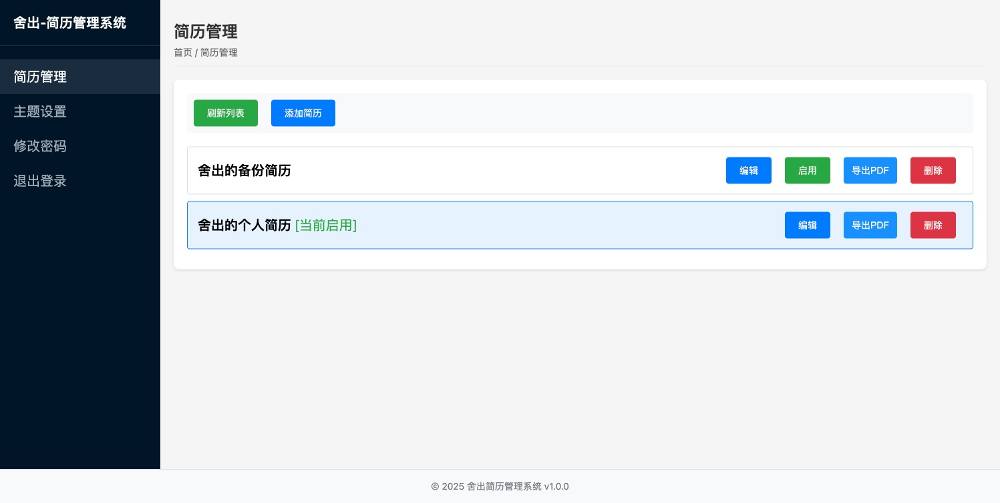

# 舍出简历管理系统

一个现代化的个人简历管理系统，支持在线简历编辑、主题切换、PDF导出等功能。

[](LICENSE)
[](https://spring.io/projects/spring-boot)
[](https://baomidou.com/)

## 关于作者

**舍出**
- 十几年互联网大厂JAVA架构师经验
- 精通全栈研发
- 专注技术分享、个人成长、认知迭代

### 关注我
- 微信公众号：shechubbb
- B站、抖音均同步更新

## 系统演示

### 用户端


### 管理端



## 功能特点

- 🚀 简历在线管理
  - 支持多份简历管理
  - 一键启用/禁用简历
  - 简历内容实时预览

- 🎨 主题定制
  - 12种精选主题色
  - 一键切换主题
  - 自动计算配色方案

- 📑 简历导出
  - 支持PDF格式导出
  - 自动生成"姓名-岗位.pdf"
  - 完美支持中文字体

- 💻 响应式设计
  - 完美适配移动端
  - 优雅的吸顶导航
  - 现代化的UI设计

## 技术栈

### 后端技术
- Spring Boot 2.6.13
- MyBatis-Plus 3.5.2
- JWT 0.9.1
- MySQL
- iText 5.5.13.3（PDF导出）

### 前端技术
- 原生JavaScript
- 响应式CSS
- CSS变量主题系统
- Fetch API

## 快速开始

### 环境要求
- JDK 8+
- MySQL 5.7+
- Maven 3.6+

### 安装步骤

1. 克隆项目
```bash
git clone 仓库地址
```

2. 创建数据库
```sql
create database resume_db;
```

3. 修改配置
```properties
# src/main/resources/application.properties
spring.datasource.url=jdbc:mysql://localhost:3306/resume_db
spring.datasource.username=your_username
spring.datasource.password=your_password
```

4. 初始化数据库
```bash
# 执行src/main/resources/init.sql脚本
```

5. 运行项目
```bash
mvn spring-boot:run
```

6. 访问系统
- 用户端：http://localhost:8080
- 管理后台：http://localhost:8080/admin
- 默认管理员账号：admin
- 默认管理员密码：admin123

## 项目结构

```
resume/
├── src/main/java/
│   └── com/shechubbb/web/resume/
│       ├── config/        # 配置类
│       ├── controller/    # 控制器
│       ├── service/       # 服务层
│       ├── mapper/        # 数据访问层
│       ├── entity/        # 实体类
│       ├── dto/           # 数据传输对象
│       ├── vo/            # 视图对象
│       └── util/          # 工具类
└── src/main/resources/
    ├── static/           # 前端资源
    ├── application.properties # 配置文件
    └── init.sql          # 数据库初始化脚本
```

## 开源协议

本项目采用 [MIT 许可证](LICENSE)。

MIT License

Copyright (c) 2025 舍出

Permission is hereby granted, free of charge, to any person obtaining a copy
of this software and associated documentation files (the "Software"), to deal
in the Software without restriction, including without limitation the rights
to use, copy, modify, merge, publish, distribute, sublicense, and/or sell
copies of the Software, and to permit persons to whom the Software is
furnished to do so, subject to the following conditions:

The above copyright notice and this permission notice shall be included in all
copies or substantial portions of the Software.